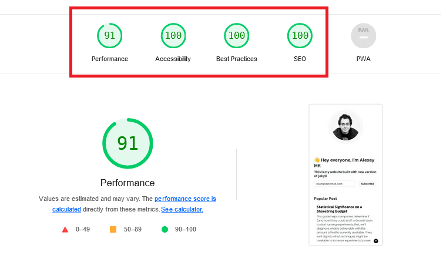
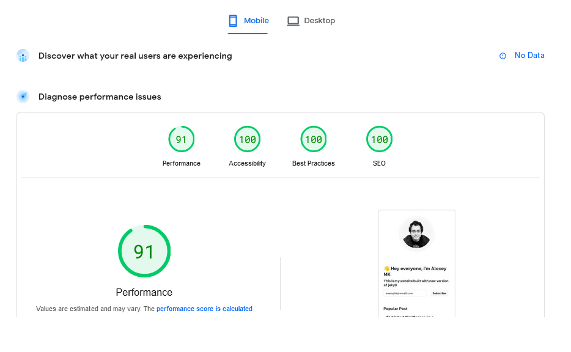

# alexeymk.com project


### 👋 Hey everyone, I’m Alexey MK

🛰️ This project is ready !! 🥳

migration to 🚀  jekyll version 4 , web developer by 👩🏻‍🚀 [creativitas](https://www.fiverr.com/creativitas/design-your-modern-website-using-jekyll)

-----
## Installing from Scratch on OSX:
1. Ruby:
`brew install asdf` (will need to add a line to ~.zshrc or equivalent)
Use asdf to install Ruby 3.2 or newer.
Then once you're using the appropriate ruby, you should be able to
2. Jekyll
`bundle install` everything
then `bundle exec jekyll run`

Recipe:
 - 💎 Jekyll V.4.3.2
 - 🪐 Bootstrap v.5.3.2
 - ⚡️ Liquid template
 - 🛰️ Auto SEO
 - 📺 Lazy Load Image Script
 - 🎬 Lazy Load Image Plugins
 - ✨ Clean Design


-----
Implementation auto image
```

```

Implementation lazyload image on markdown post
- `{:loading='eager'}`

Implementation on template lazy image plugin and script
- ``
- ``
-----
💻 Test drive

`git clone -b newversion https://github.com/AlexeyMK/alexeymk.com.git`

and run `bundle exec jekyll serve` or `jekyll serve`

Open `localhost:3000`

-----

🎓 Documentation 👉  [Read here](/assets/doc/alexeymk.com.pdf) 👈


-----

🏍️ Test Drive



Lighthouse score


Page speed desktop peform




Page speed mobile peform

-----

Thank you


[Creativitas](https://www.fiverr.com/creativitas/design-your-modern-website-using-jekyll)

[https://www.fiverr.com/creativitas/design-your-modern-website-using-jekyll](https://www.fiverr.com/creativitas/design-your-modern-website-using-jekyll)

-----

Notes for changes:

lorep ipsum dolor siamet

