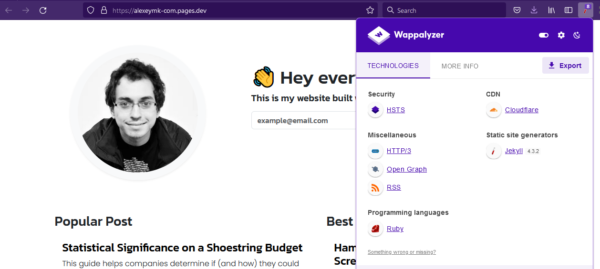
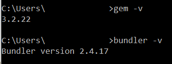

# alexeymk.com project


### 👋 Hey everyone, I’m Alexey MK

🛰️ This project is ready !! 🥳

migration to 🚀  jekyll version 4 , web developer by 👩🏻‍🚀 [creativitas](https://www.fiverr.com/creativitas/design-your-modern-website-using-jekyll)

-----

Recipe: 
 - 💎 Jekyll V.4.3.2
 - 🪐 Bootstrap v.5.3.2
 - ⚡️ Liquid template
 - 🛰️ Auto SEO
 - 📺 Lazy Load Image Script
 - 🎬 Lazy Load Image Plugins
 - ✨ Clean Design


-----
Implementation auto image
``` 

```

Implementation lazyload image on markdown post
- `{:loading='eager'}`

Implementation on template lazy image plugin and script
- ``
- ``
-----
💻 Test drive 

`git clone -b newversion https://github.com/AlexeyMK/alexeymk.com.git`

and run `bundle exec jekyll serve` or `jekyll serve`

Open `localhost:3000`

-----

🎓 Documentation 👉  [Read here](/assets/doc/alexeymk.com.pdf) 👈


-----

🏍️ Test Drive


Lighthouse score


Page speed desktop peform


Page speed mobile peform

-----

Thank you


[Creativitas](https://www.fiverr.com/creativitas/design-your-modern-website-using-jekyll)

[https://www.fiverr.com/creativitas/design-your-modern-website-using-jekyll](https://www.fiverr.com/creativitas/design-your-modern-website-using-jekyll)

-----

Notes for changes:

Alexey TODO

1. Get it running locally 
 - First installation reference : 
    - Jekyll Doc (https://jekyllrb.com/docs/installation/macos/)
    - [Installation on Mac](https://www.moncefbelyamani.com/how-to-install-xcode-homebrew-git-rvm-ruby-on-mac/)
    - [Video from cloudcannon](https://www.youtube.com/watch?v=buZ-v5Qt19w&pp=ygUVaW5zdGFsbCBqZWt5bGwgb24gbWFj)
 - [How to install  - read doc section 1](https://github.com/AlexeyMK/alexeymk.com/blob/newversion/assets/doc/alexeymk.com.pdf)
 - Update readme to actually explain latest versions of ruby, etc.
 - 
 - 
 - `Gem -v 3.2.2`
 - `Jekyll V. 4.3.2`
 - `bundler V.2.4.17`

2. Add GTM & GA4
 - You need to register to google / universal analystic and google tag manager with your account - alexey86@gmail.com.

3. Test various side pages:
 - Contact - redirect to mailto
 - About - [About page](https://alexeymk-com.pages.dev/about)
 - Newsletter - redirect to email subscription

4.Write updated copy
 - Home page - [Documentation section 2](https://github.com/AlexeyMK/alexeymk.com/blob/newversion/assets/doc/alexeymk.com.pdf)
 - Top posts - [Documentation section 2](https://github.com/AlexeyMK/alexeymk.com/blob/newversion/assets/doc/alexeymk.com.pdf)
 - About page (?) - [Documentation section 2](https://github.com/AlexeyMK/alexeymk.com/blob/newversion/assets/doc/alexeymk.com.pdf) - All pages - Location on pages folder.
 - CTA for email - redirect to email subscription
 - CTA / style for sharing - redirect to social share

5. Setup Analytics
 - Migrate the useful clear bit thing into GTM - You only need to enter your analyst code on google - tagmanager - in the _config.yml file
 - Setup GTM with targets of email subscribe & contact - You can set it yourself in the settings in your Google Tag Manager. Because I only integrate Google tags and analytics.

6. Test image hosting
 - Add new image & check size & resolution on mobile & desktop - following your request by upscaling to retina display at 1200px with responsive image.
 - Test cover image, see how those work - Covers are used to display images on websites, and also for OpenGraph and Twitter cards. - reference : [Documentation section 5](https://github.com/AlexeyMK/alexeymk.com/blob/newversion/assets/doc/alexeymk.com.pdf)

7. Deploys
 - Launch to test domain - reference [Documentation section 9](https://github.com/AlexeyMK/alexeymk.com/blob/newversion/assets/doc/alexeymk.com.pdf)
 - Ensure “deploy on push to master” to work  - you need to create new branch and call it master , because your repo is use blog_source, and i create new repo with newversion for develope your new version jekyll website - solutions you can use newversion branch to set as default repo , The logic is the same, only the naming, master, blog_source, or newversion are just branch names, the most important thing is the point where the website deploys the repo - in this case newversion is the default.- reference [Documentation section 1](https://github.com/AlexeyMK/alexeymk.com/blob/newversion/assets/doc/alexeymk.com.pdf) - After making update and changes, then you can then send it to your repo. Make sure you have cloned the repo, then run the following command `git branch -M newversion`  - `git add .` - `git commit -m "update post example"` - then `git push`

8. Review past articles
 - See if there are any worth hiding / not highlighting. - yes you can check it.

9. Instructions: migrate any remaining bits of readme into readme.md - The readme is only for instructions and reviews, your old readme is for instructions regarding the old repo and works with the old version of Jekyll, while the new branch uses the new version of Jekyll accompanied by new instructions via the new readme.

10. Ship: Deploy DNS to point to Cloudflare - reference [Documentation section 9](https://github.com/AlexeyMK/alexeymk.com/blob/newversion/assets/doc/alexeymk.com.pdf) 

11. Deprecate old repository / leave note explaining why. - Because we are migrating to the latest version, we need to create a new branch, because from the brief you want the old repo to still be there.
Another alternative: you can push the clone from the newversion branch to the blog_source branch. so that your blogsource can be used for the deploy process, and after that delete the newversion branch.


